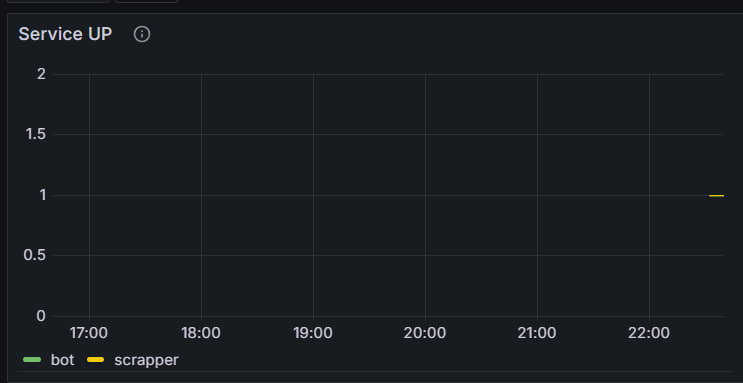
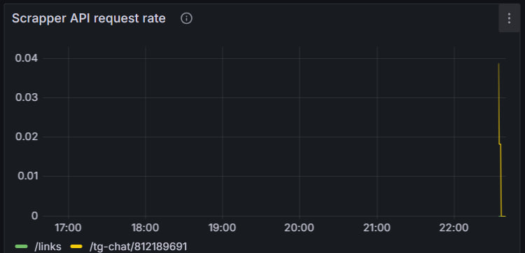
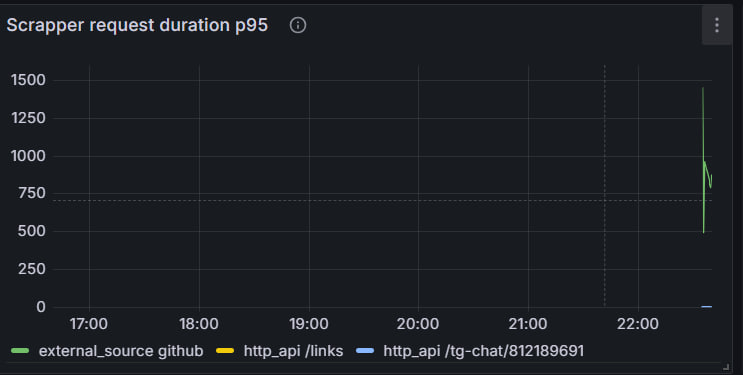
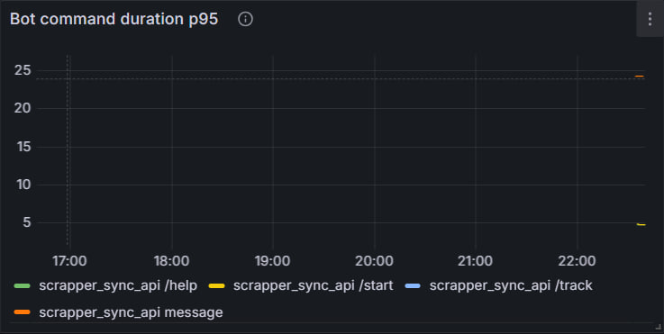
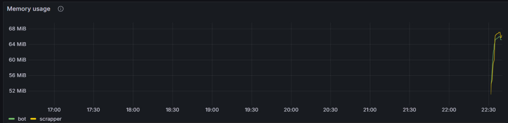
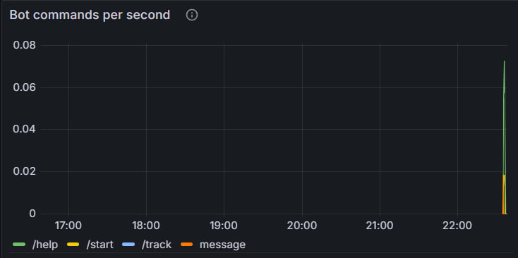
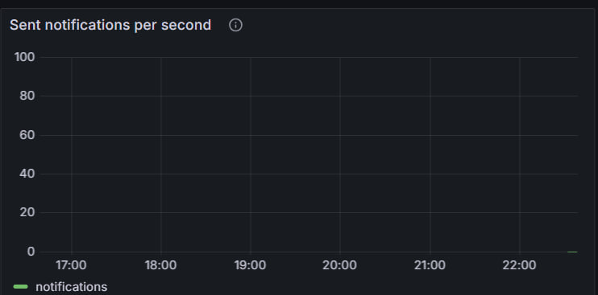
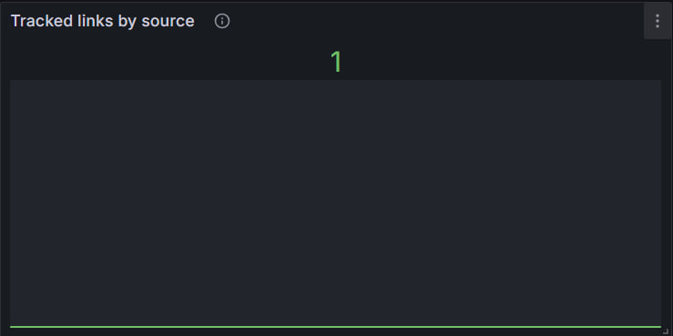
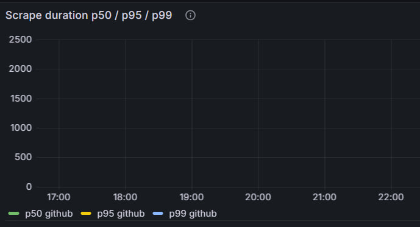
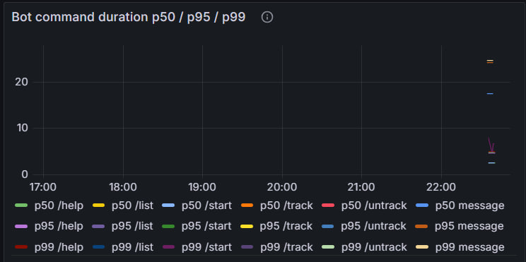

# Описание

Для мониторинга приложения используется стек:

* Prometheus — сбор метрик по Pull-модели;
* Grafana — визуализация метрик и построение дашбордов;
* Prometheus Go Client — экспорт метрик из приложений Bot и Scrapper.

Метрики публикуются через HTTP endpoint:

* Bot: `http://bot:8011/metrics`
* Scrapper: `http://scrapper:8012/metrics`

---

# Подключенные метрики

## Bot Service

### command_requests_total

Тип: Counter

Лейблы:

* command — имя обработанной команды

Описание:

Счетчик обработанных пользовательских команд.

Примеры:

* /start
* /track
* /untrack
* /list

---

### command_duration_ms_total

Тип: Histogram

Лейблы:

* scope
* scope_type

Описание:

Длительность обработки пользовательских команд.

Используется для расчета:

* p50
* p95
* p99

перцентилей времени обработки команд.

---

### sent_notification_total

Тип: Counter

Описание:

Количество отправленных пользователям уведомлений.

---

## Scrapper Service

### api_requests_total

Тип: Counter

Лейблы:

* source

Описание:

Количество запросов к API Scrapper.

---

### request_duration_ms_total

Тип: Histogram

Лейблы:

* scope
* scope_type

Описание:

Длительность операций Scrapper.

Используется для измерения:

* работы с БД;
* внешних источников (GitHub, StackOverflow);
* взаимодействия с другими сервисами.

---

### links_on_track_total

Тип: Gauge

Лейблы:

* tracked_source

Описание:

Количество ссылок, находящихся на мониторинге.

Разделяется по источнику:

* github
* stackoverflow

---

# RED Dashboard

## Service Availability

Показывает доступность сервисов.

PromQL:

```promql
up
```



---

## Scrapper API Request Rate

Количество запросов к API Scrapper в секунду.

PromQL:

```promql
sum by (source) (
  rate(api_requests_total[1m])
)
```



---

## Scrapper Request Duration P95

95-й перцентиль времени выполнения операций Scrapper.

PromQL:

```promql
histogram_quantile(
  0.95,
  sum by (le, scope, scope_type) (
    rate(request_duration_ms_total_bucket[5m])
  )
)
```



---

## Bot Command Duration P95

95-й перцентиль времени обработки команд Bot.

PromQL:

```promql
histogram_quantile(
  0.95,
  sum by (le, scope, scope_type) (
    rate(command_duration_ms_total_bucket[5m])
  )
)
```


---

## Memory Usage

Потребление памяти приложением.

PromQL:

```promql
process_resident_memory_bytes
```



---

# Business Dashboard

## User Commands Per Second

Количество пользовательских команд в секунду.

PromQL:

```promql
sum by (command) (
  rate(command_requests_total[1m])
)
```



---

## Sent Notifications Per Second

Количество отправленных уведомлений в секунду.

PromQL:

```promql
rate(sent_notification_total[1m])
```



---

## Active Links By Source

Количество активных ссылок в мониторинге.

PromQL:

```promql
links_on_track_total
```


---

## Scrape Duration P50

PromQL:

```promql
histogram_quantile(
  0.50,
  sum by (le, scope_type) (
    rate(request_duration_ms_total_bucket{scope="external_source"}[5m])
  )
)
```

---

## Scrape Duration P95

PromQL:

```promql
histogram_quantile(
  0.95,
  sum by (le, scope_type) (
    rate(request_duration_ms_total_bucket{scope="external_source"}[5m])
  )
)
```

---

## Scrape Duration P99

PromQL:

```promql
histogram_quantile(
  0.99,
  sum by (le, scope_type) (
    rate(request_duration_ms_total_bucket{scope="external_source"}[5m])
  )
)
```


---

## Bot Command Duration P50

PromQL:

```promql
histogram_quantile(
  0.50,
  sum by (le, scope, scope_type) (
    rate(command_duration_ms_total_bucket[5m])
  )
)
```

---

## Bot Command Duration P95

PromQL:

```promql
histogram_quantile(
  0.95,
  sum by (le, scope, scope_type) (
    rate(command_duration_ms_total_bucket[5m])
  )
)
```

---

## Bot Command Duration P99

PromQL:

```promql
histogram_quantile(
  0.99,
  sum by (le, scope, scope_type) (
    rate(command_duration_ms_total_bucket[5m])
  )
)
```


---

# Запуск мониторинга

## Запуск инфраструктуры

```bash
docker compose up -d
```

После запуска будут доступны:

| Компонент        | URL                           |
| ---------------- | ----------------------------- |
| Grafana          | http://localhost:3000         |
| Prometheus       | http://localhost:9090         |
| Bot Metrics      | http://localhost:8011/metrics |
| Scrapper Metrics | http://localhost:8012/metrics |

---

## Grafana

Логин:

```text
admin
```

Пароль:

```text
admin
```

---

## Проверка метрик

Проверить доступность сервисов:

```promql
up
```

Проверить пользовательские команды:

```promql
command_requests_total
```

Проверить уведомления:

```promql
sent_notification_total
```

Проверить ссылки на мониторинге:

```promql
links_on_track_total
```

---

## Дашборды

В Grafana автоматически импортируются:

* Link Tracker RED Metrics
* Link Tracker Business Metrics

Дашборды используют источник данных Prometheus и поддерживают фильтрацию по типу приложения.
